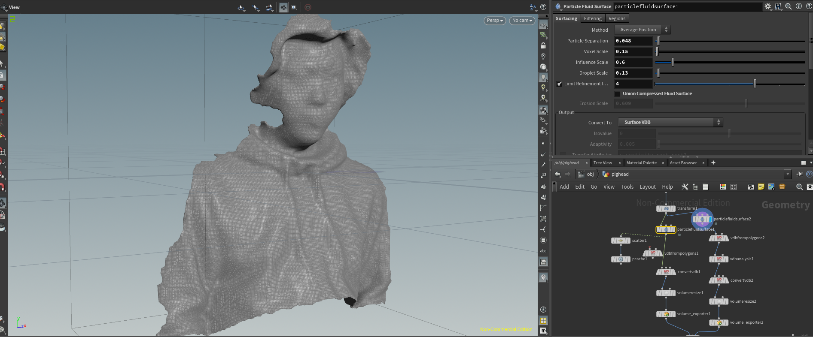
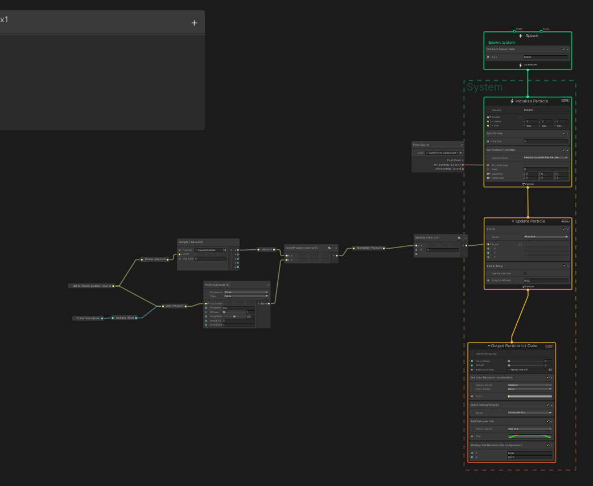

# KinFuSDFVFX

## About

KinectFusionを使ってスキャンしたデータをHoudiniでSigned Distance Fieldとして出力し、それをUnity VFX Graphで利用するサンプル

## Tested Environment

|Env||
|:--:|:--:|
|OS|Windows 10 Home|
|Azure Kinect SDK|1.4.1|
|Houdini|Apprentice 18.5|
|Unity|2020.2.6|
|HDRP|10.3.1|

## Setup & Usage

### Kinect Fusion

自分の場合はAzure Kinect SamplesのKinectFusionを実行しました。
[こちらの記事](https://medium.com/kadinche-engineering/azure-kinect-dk-%E3%81%AE%E9%96%8B%E7%99%BA%E7%92%B0%E5%A2%83%E6%A7%8B%E7%AF%89%E3%81%8B%E3%82%89-kinectfusion-%E3%81%AE%E3%82%B5%E3%83%B3%E3%83%97%E3%83%AB%E3%82%92%E5%8B%95%E3%81%8B%E3%81%99%E3%81%BE%E3%81%A7-cd7d550994fe)がとても親切に導入までを解説してくださっていますので、ご参考になさってください。
正しくビルドができたらwキーを押せばplyが出力されるはずです。

サンプルとして、[自分のスキャンデータ](./Houdini/ninisan_n.ply)が入っています。

### Houdini

[Houdiniのサンプルデータ](./Houdini/VolumeExporter.hipnc)を同梱しています。
このサンプルではplyフォーマットの点群をインポートしてメッシュ化し、PointCacheデータと2種類のVectorFiled(Distance FieldとGradient Field)を出力しています。
出力には、[Unity TechnolgiesのVFXToolbox](https://github.com/Unity-Technologies/VFXToolbox)から提供されているVolumeExporterを用いました。

### Unity

`/Assets/KinFuSDFVFX/VFXAssets`内にpcacheおよびvfファイルを置いてあります。
スキャンデータに這って動くようなVFXのサンプルを同梱してあります。

また、画面を録画できるようにUnityRecorderも追加でインポートしてあります。

## Contact

何かございましたら、[こちらのTwitter](https://twitter.com/ninisan_drumath)までよろしくお願いします。
